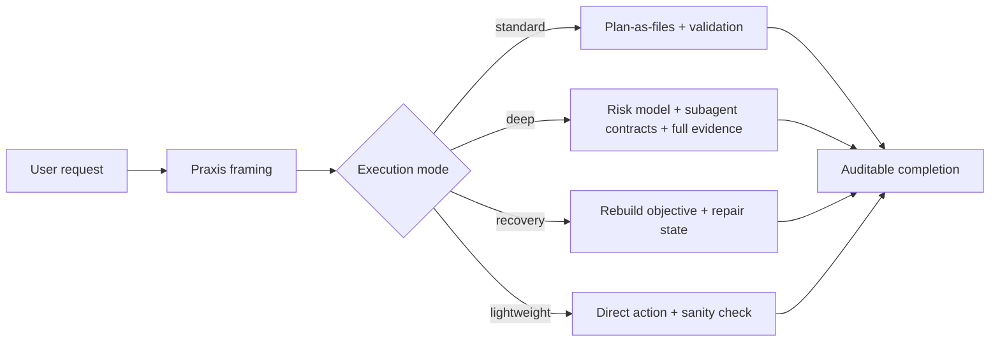
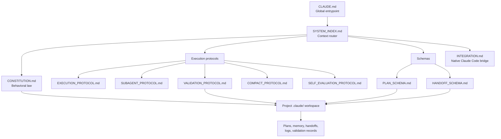
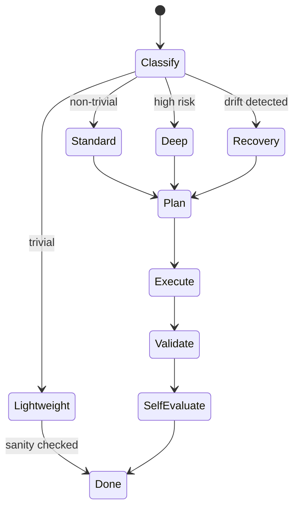
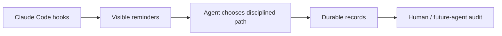

# Claude-Praxis

> A constitutional execution harness for Claude Code.

[简体中文](README.zh-CN.md)

Claude-Praxis turns ad-hoc Claude Code sessions into structured, auditable, recoverable work. It adds a thin operating layer around Claude Code: goal framing, mode selection, durable planning, scoped subagents, validation evidence, and continuity across context compaction.

The name comes from Greek **praxis** (πρᾶξις): disciplined practice, where theory becomes action. In this project, the theory is simple:

**Code written is not the same thing as task done.**

## Why This Exists

Claude Code is already powerful. The problem is not capability; it is operational discipline under real work:

- user requests are often symptoms, not true goals
- long sessions lose state when context compacts
- subagents can drift without bounded handoffs
- completion claims can arrive before evidence
- small tasks should stay small, but large tasks need structure

Claude-Praxis adds the missing control plane without replacing Claude Code's native tools.



## Core Idea

Claude-Praxis is not a prompt pack. It is a **governance layer** for agentic engineering work.

It separates four things that often get blurred in AI coding sessions:

| Layer | Question | Praxis answer |
|---|---|---|
| Intent | What is the user really trying to achieve? | Anti-XY review and objective modeling |
| Strategy | What should happen across phases or sessions? | Versioned plan files |
| Execution | What should happen right now? | Native Claude Code tools, TodoWrite, Skills, MCP |
| Evidence | How do we know it worked? | Validation ladder and self-evaluation |

The result is an agent that behaves less like a one-shot autocomplete loop and more like a careful engineering operator.

## Architecture



### Repository Map

| File | Role |
|---|---|
| `CLAUDE.md` | Global entrypoint and execution mode rules |
| `SYSTEM_INDEX.md` | Routing index for loading only the required protocol files |
| `CONSTITUTION.md` | High-level behavioral law: anti-XY, durable state, validation |
| `INTEGRATION.md` | Mapping to Claude Code native features: TodoWrite, Agent, Skills, MCP, hooks |
| `EXECUTION_PROTOCOL.md` | Main execution loop and mode-driven behavior |
| `SUBAGENT_PROTOCOL.md` | Scoped subagent dispatch and search-boundary contract |
| `VALIDATION_PROTOCOL.md` | Evidence ladder for code and non-code deliverables |
| `COMPACT_PROTOCOL.md` | Continuity before and after context compaction |
| `SELF_EVALUATION_PROTOCOL.md` | Post-task audit for non-trivial work |
| `PLAN_SCHEMA.md` | Versioned plan file schema |
| `HANDOFF_SCHEMA.md` | Subagent task and result schema |
| `PROJECT_STRUCTURE_SPEC.md` | Project-local `.claude/` workspace specification |
| `MIGRATION_PROTOCOL.md` | Versioning, migration, sync, and drift rules |
| `install.sh` | Idempotent installer and integrity checker |
| `settings.json.sample` | Advisory hook sample for Claude Code settings |
| `metrics/` | Optional aggregate records for protocol adherence and failure patterns |

## Execution Modes

Praxis avoids turning every request into a ceremony. Work is classified first.

| Mode | Use when | Protocol overhead |
|---|---|---|
| `lightweight` | Trivial task: <=2 files, <=8 tool calls, single domain, no durable state needed | No plan file; direct work plus sanity check |
| `standard` | Ordinary non-trivial work | Plan-as-files, validation ladder, self-evaluation |
| `deep` | Refactors, migrations, architecture decisions, multi-agent work, high risk | Full protocol, risk tracking, bounded subagents |
| `recovery` | Drift detected: lost objective, skipped validation, broken plan state | Reconstruct objective and repair durable state |



## Project Workspace

For non-trivial work, Praxis creates or uses a project-local `.claude/` workspace.

```text
<repo>/.claude/
├── WORKSPACE_INDEX.md
├── CLAUDE.md
├── constitution/
├── context/
├── plans/
│   ├── active/
│   └── archive/
├── memory/
├── handoffs/
│   ├── inbox/
│   ├── outbox/
│   └── shared/
├── validation/
└── logs/
```

This workspace is the durable substrate. Conversation is useful, but files are canonical.

## Why This Is Better

### 1. It Optimizes for the Real Goal

Praxis forces the agent to distinguish the literal request from the likely objective. This reduces polished wrong answers: the system is allowed to challenge a bad framing before implementing it.

### 2. It Survives Long Sessions

Plans, decisions, assumptions, risks, rejected paths, validation results, and compact summaries are written to files. A future session can rehydrate from the project workspace instead of relying on fragile chat memory.

### 3. It Makes Subagents Auditable

Subagents receive bounded task packets and return structured results. The main agent remains responsible for integration, promotion into memory, and final judgment.

### 4. It Separates Strategy From Tactics

Claude Code's native TodoWrite is excellent for current-session steps. Praxis plan files are for cross-session strategy. `INTEGRATION.md` defines how both should coexist.

### 5. It Makes Completion Evidence-Based

The validation ladder prevents "implemented" from being confused with "done". For documentation and configuration tasks, `VALIDATION_PROTOCOL.md` includes a non-code validation branch.

## Install

Clone the repository:

```bash
git clone https://github.com/ZIONISREAL/Claude-Praxis.git
cd Claude-Praxis
```

Dry-run the installer:

```bash
./install.sh --from . --dry-run
```

Install or upgrade:

```bash
./install.sh --from .
```

Check an existing install:

```bash
./install.sh --check
```

Claude Code settings are user-specific. This repository ships `settings.json.sample`; merge its `hooks` into your `~/.claude/settings.json` if you want advisory hook signals.

## Hook Philosophy

Hooks are intentionally advisory. They make protocol adherence visible, but they do not block tool execution.



This matters because hard enforcement can make daily work brittle. Praxis aims for disciplined behavior without turning the tool into a cage.

## Benchmark Proposal

Claude-Praxis is a workflow harness, so its performance should be measured by task outcomes rather than raw token speed.

### Suggested Benchmark Design

Run the same task suite twice:

1. **Baseline**: Claude Code with no Praxis harness
2. **Praxis**: Claude Code with Claude-Praxis installed

Use 20-40 representative tasks:

| Task type | Example |
|---|---|
| Lightweight | Rename a field, adjust a config, update one doc |
| Standard | Implement a small feature across 3-6 files |
| Deep | Refactor a module, migrate an API, split a service |
| Recovery | Resume after context compaction or failed validation |
| Anti-XY | User asks for a surface fix where root cause differs |

### Metrics

| Metric | What it measures | Expected direction |
|---|---|---|
| First-pass success rate | Task works after the first completed attempt | Higher on standard/deep tasks |
| Objective-fit score | Did the result solve the real problem, not just the literal request? | Higher |
| Validation coverage | Was meaningful evidence produced before completion? | Much higher |
| Context recovery time | Time to resume after compaction or session restart | Lower |
| Rework rate | Number of follow-up fixes caused by missed assumptions | Lower |
| Lightweight overhead | Extra time for trivial tasks | Near zero if mode classification works |
| Token/tool overhead | Additional reads/writes caused by the harness | Higher on deep tasks, controlled on lightweight tasks |

### Example Scorecard Template

```text
task_id,mode,baseline_success,praxis_success,baseline_minutes,praxis_minutes,
baseline_validation_level,praxis_validation_level,rework_count,objective_fit_1_to_5
```

The likely tradeoff is intentional:

- small tasks should remain nearly as fast as baseline
- standard/deep tasks may spend more up front
- complex tasks should repay that cost through fewer restarts, fewer missed assumptions, and better validation evidence

## Status

Current version: `1.0.1`

See `VERSION` and `CHANGELOG.md`.

## License

MIT. See `LICENSE`.
