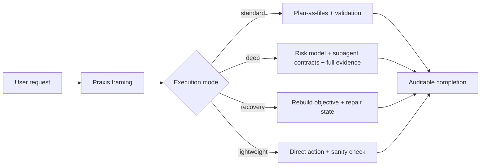
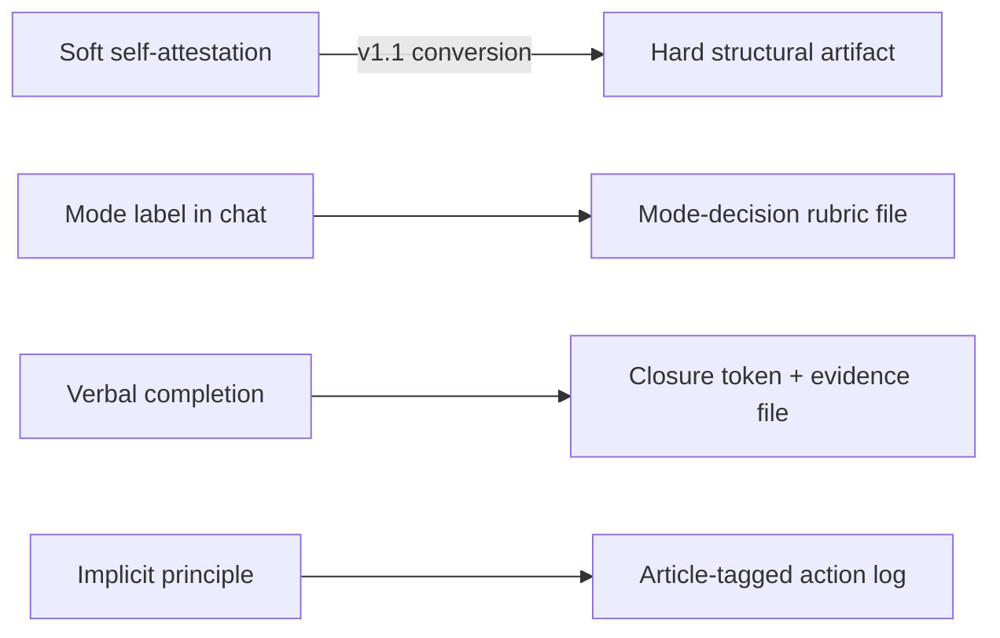
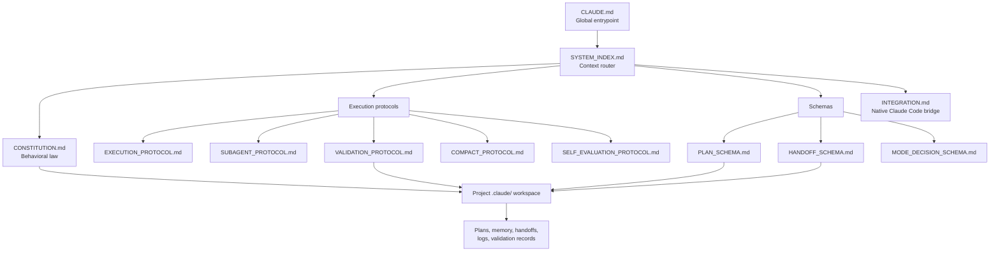
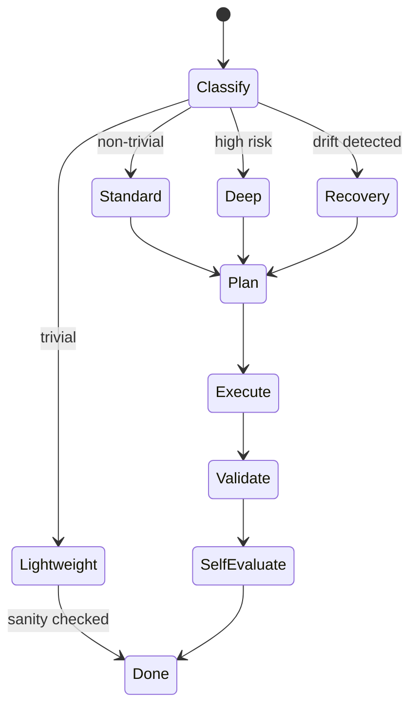
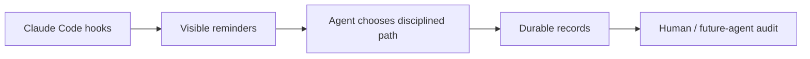

# Claude-Praxis

> **A lightweight operating layer for Claude Code and Codex that makes AI coding work planned, auditable, and actually verified.**

[English](README.md) · [简体中文](README.zh-CN.md)

---

## What Is This?

Claude-Praxis is a governance layer for AI coding agents.

It does not replace Claude Code or Codex. It gives them a disciplined way to work:

1. understand the real objective, not just the literal prompt
2. choose the right execution mode for the task size
3. write durable plans and handoffs to files
4. keep subagents bounded when the task is large
5. validate the result before claiming it is done
6. leave evidence a future agent or human can audit

In plain English: it turns a coding agent from "I'll try the task and summarize what I did" into "I'll frame the goal, make a plan, execute in bounded steps, verify the outcome, and leave a paper trail."

Claude-Praxis now supports both:

| Agent | Global entrypoint | Global install path | Project workspace |
|---|---|---|---|
| Claude Code | `CLAUDE.md` | `~/.claude/` | `<repo>/.claude/` |
| Codex | `AGENTS.md` | `~/.codex/` | `<repo>/.codex/` |

---

## What It Changes

Imagine you ask an agent:

> "Refactor our payment retry logic and make sure checkout still works."

Without Praxis, the agent may jump straight into files, make plausible edits, run one convenient test, and say "done." If context gets long, it may forget why it chose a path. If a subagent was used, the handoff may be invisible. If validation was skipped, you only discover that later.

With Praxis, the agent is pushed into a visible workflow:

| Moment | What Praxis makes visible |
|---|---|
| Before editing | Is this lightweight, standard, deep, or recovery work? |
| During planning | What is the real objective? What is out of scope? What could fail? |
| During execution | Which files, handoffs, decisions, and risks changed? |
| During validation | What command or check actually proved the result? |
| At completion | Where is the evidence file, and does the closure claim point to it? |

The effect is practical: fewer "looks done" failures, less lost context, safer subagent use, and a project memory that survives long sessions.

---

## Concrete Examples

### Example 1 — A Small Bug Fix

Prompt:

> "Fix the date formatting bug in the invoice table."

Praxis classifies this as `lightweight` if it is truly small. The agent can edit directly and run a sanity check. No ceremony for a one-file fix.

### Example 2 — A Risky Refactor

Prompt:

> "Refactor auth middleware so mobile and web share the same session validation."

Praxis classifies this as `standard` or `deep`. The agent writes a plan under the project workspace, records assumptions, tracks risks, and validates the real entrypoints instead of only checking that TypeScript compiles.

### Example 3 — A Long Multi-Agent Task

Prompt:

> "Migrate this app from one database schema to another and preserve existing user data."

Praxis requires scoped handoffs. One subagent may inspect schema usage, another may review migration risks, and the main agent integrates the results into a durable plan. The work can survive context compaction because the important state is in files, not just chat.

---

## Install In 30 Seconds

### Claude Code

```bash
git clone https://github.com/ZIONISREAL/Claude-Praxis ~/Claude-Praxis
cd ~/Claude-Praxis && ./install.sh --from .
```

Open Claude Code in any project and try a real task:

> *"Refactor this module's error handling and verify tests still pass."*

Praxis auto-classifies mode, writes plan-as-files when needed, uses scoped subagents for larger work, validates against the real objective, and emits a closure token coupling the claim to evidence.

### Codex

```bash
git clone https://github.com/ZIONISREAL/Claude-Praxis ~/Claude-Praxis
cd ~/Claude-Praxis && ./install-codex.sh --from . --force
```

Open Codex in any project and try the same kind of real task. Codex-Praxis uses `AGENTS.md`, installs into `~/.codex/`, and maps the durable workspace convention to `<repo>/.codex/`.

---

## What You Get

- **Mode-aware execution** — trivial tasks stay trivial; non-trivial tasks get plans, subagents, and validation
- **Auditable meta-decisions** — every classification, dispatch, and closure leaves a file an outside reviewer can inspect
- **~50% token-efficient** — measured per-task reduction vs naive inline-prompt patterns
- **One-line updates** — `~/.claude/install.sh --update` or `~/.codex/install-codex.sh --update`

---

## Latest — v1.3.0

v1.3.0 adds a Codex-compatible distribution path:

- `AGENTS.md` as the Codex entrypoint
- `CODEX_INTEGRATION.md` for Claude-to-Codex path/tool mapping
- `install-codex.sh` for idempotent local deployment into `~/.codex/`

## Token Reduction — v1.2.0

| Metric | Before v1.2 | After v1.2 |
|---|---|---|
| Per-task overhead | ~12,000 tokens | ~5,000–6,000 tokens |
| Subagent dispatch prompt | ~5,000 tokens | ~50 tokens |
| Minimal protocol read set | 7 files | 3 files |
| Update mechanism | manual git pull | `install.sh --update` |

[v1.2.0 release notes](https://github.com/ZIONISREAL/Claude-Praxis/releases/tag/v1.2.0) · [v1.1.0](https://github.com/ZIONISREAL/Claude-Praxis/releases/tag/v1.1.0) · [Benchmark methodology](metrics/token-cost-baseline.md) · [CHANGELOG](CHANGELOG.md)

---

The name comes from Greek **praxis** (πρᾶξις): disciplined practice, where theory becomes action. Code written is not the same thing as task done.

Claude-Praxis turns ad-hoc Claude Code or Codex sessions into structured, auditable, recoverable work. It adds a thin operating layer around the coding agent: goal framing, mode selection, durable planning, scoped subagents, validation evidence, and continuity across context compaction.

---

## Why This Exists

Claude Code and Codex are already powerful. The problem is not capability; it is operational discipline under real work:

- user requests are often symptoms, not true goals
- long sessions lose state when context compacts
- subagents can drift without bounded handoffs
- completion claims can arrive before evidence
- small tasks should stay small, but large tasks need structure

Claude-Praxis adds the missing control plane without replacing the agent's native tools.



---

## The Four Failure Modes Praxis Addresses

These are not hypothetical edge cases. They are LLM-systemic patterns that appear in real Claude Code sessions. v1.1 was designed specifically to address them.

### a) Mode Under-Classification Bias

LLMs systematically prefer the lowest-overhead execution classification, biasing toward lightweight even when a task is non-trivial. The bias is asymmetric — agents almost never over-classify. The effect is predictable: plan-as-files is skipped, the validation ladder is never reached, and downstream drift accumulates without a traceable cause. The mode decision feels right in the moment; the evidence of its wrongness only appears later.

### b) Validation Skip Under Completion Pressure

As context fills or a task begins to feel "almost done," agents develop a strong wrap-up bias that bypasses the validation ladder. Completion claims arrive before evidence exists. This failure mode worsens specifically near context-window saturation, precisely the moment when the temptation to close out is highest and the capacity for careful review is lowest.

### c) Constitutional Violation Invisibility

Behavioral law is stated but unobserved. When an agent under pressure sidesteps a constitutional principle — skipping a plan file, eliding an anti-XY check — execution continues silently. The system has no signal to trigger correction. Drift accumulates unaudited. The problem is not that agents cannot follow rules; it is that nothing requires them to leave a trace when they do not.

### d) Subagent Search-Scope Drift

Subagents naturally expand scope when investigating, eroding the bounded-task discipline that makes decomposed work safe. This failure mode was addressed in v1.0 by placing search-scope responsibility on the dispatching main agent, not the subagent (see `SUBAGENT_PROTOCOL.md` §7). The main agent owns the boundaries; the subagent executes within them.

---

## Design Philosophy — Self-Attestation vs. Structural Artifacts

Each failure mode above shares a root cause: **the harness asked the agent to comply, but never asked the agent to leave evidence of compliance.** Self-attestation under model pressure is unreliable. A disciplined-sounding completion message is not the same thing as disciplined execution.

The fix is structural: every meta-decision must produce a file-backed artifact that an outside reviewer — the user, a future agent, an audit subagent — can inspect without asking.

The v1.0 harness already applied this principle to *strategy* via plan-as-files. The v1.1 release extends it to *meta-decisions*: classification, closure, and constitutional adherence.



---

## v1.1 Mechanisms

For each mechanism: the problem addressed, the chosen design, why this design over alternatives, and where the artifact lives.

### 1B — Mode-Decision Rubric File

**Addresses:** failure mode (a) — mode under-classification bias.

**Mechanism:** Before taking any first action, standard / deep / recovery mode tasks must write a mode-decision file at `<repo>/.claude/_meta/mode-decisions/<plan-id>.md`, conforming to `MODE_DECISION_SCHEMA.md`. The schema contains a quantitative rubric: file count, tool-call estimate, domain count, production path exposure, multi-phase flag, and other measurable criteria. The classification decision is derived from these numbers, not from impressionistic judgment.

**Why this over alternatives:** An adversarial "argue both sides" mechanism was considered — have the agent explicitly argue for a higher mode before accepting the lower one. This was rejected in favor of a quantitative rubric. The rubric is checkable post-hoc by any reviewer without knowing the original context. Argumentation is not.

**Lightweight mode is exempt.** The zero-friction principle for trivial tasks is preserved. The rubric applies only when a formal mode is chosen.

**Artifact location:** `<repo>/.claude/_meta/mode-decisions/<plan-id>.md`

---

### 2A — Closure Token

**Addresses:** failure mode (b) — validation skip under completion pressure.

**Mechanism:** A completion claim in standard / deep / recovery mode must include a closure token of the form:

```
[CLOSURE: plan=<plan-id> evidence=<path> last-line="<last non-empty line of evidence file>" at=<ISO-8601>]
```

The `last-line` field must contain the actual last non-empty line of the referenced evidence file. The message is syntactically incomplete — and therefore suspect — without it.

**Why this over alternatives:** Discipline-level rules ("you must validate before claiming done") fail under completion pressure. They are also unverifiable: a rule-following message looks identical to a genuinely validated one. Format-level rules couple the claim and the evidence at the syntactic layer — the LLM cannot produce a valid closure token without also producing a valid evidence file, because the token includes a quoted fragment that must correspond to that file.

**Lightweight mode emits a simple "done."** The closure token applies only to formalized work where plan-as-files is required.

**Artifact location:** `<repo>/.claude/_meta/validation/closure-<plan-id>.md`

---

### 3A — Article-Tagged Action Log + Mandatory Non-Empty Skipped Rules

**Addresses:** failure mode (c) — constitutional violation invisibility.

**Mechanism (two parts):**

1. Decision-class actions in `execution-log.md` must carry a constitutional-article tag. Example: `[§VIII subagent-law] dispatch sa-investigator-1 — bounded to /src/auth/`
2. The `Skipped Rules` section in `SELF_EVALUATION_PROTOCOL.md` is mandatory non-empty for non-lightweight tasks. A claim of zero skipped rules is treated as suspect by default.

**Why this over alternatives:** Two philosophically distinct responses exist to constitutional drift: enforcement (cage the agent) or observability (require the agent to leave a trace). Praxis chose observability. Enforcement makes daily work brittle and creates incentives to reclassify work as lightweight to escape the cage. Observability asks the agent to be honest about its own execution, which scales better and surfaces real failure patterns in `metrics/`.

The forced-honesty rule on Skipped Rules counters what might be called the "false purity" failure mode. Humans skip rules under real conditions; LLMs do too. A self-evaluation with no skipped rules and no anomalies is not a sign of perfect execution — it is a sign of inattentive self-evaluation.

**Artifact locations:** `<repo>/.claude/logs/execution-log.md`, `<repo>/.claude/validation/self-evaluation.md`

---

## Validation Evidence — How We Know v1.1 Works

Praxis v1.1 was validated by applying the new rules to its own implementation. After the v1.1 mechanisms were installed, the implementing subagent (Sonnet 4.6, medium effort) returned an honest assessment that included a known evasion path on the closure token: a dishonest agent can fabricate the `last-line` value without actually reading the evidence file.

This honest disclosure is itself the v1.1 system working. By the new rules, the `Skipped Rules` section of `SELF_EVALUATION_PROTOCOL.md` must be non-empty, and false purity is suspect by default. The subagent surfaced the limitation rather than hiding it — which is the behavior the harness was designed to produce.

The actual closure token from the v1.1 batch 1 release (v1.1.0 release; see CHANGELOG for v1.2.0 token-reduction work):

```
[CLOSURE: plan=plan-praxis-v11-batch1-v001 evidence=_meta/validation/closure-praxis-v11-batch1-v001.md last-line="praxis-v11-batch1-closed-2026-04-27" at=2026-04-27T08:47:02Z]
```

---

## Roadmap — The Optimization Path Forward

Each next batch is gated on observed v1.1 task data accumulating in `metrics/`. The harness should not evolve faster than evidence supports.

### Next: 3D — Phase-Boundary Audit Subagent

**Why first:** Directly addresses the closure-token forgeability identified in v1.1 batch 1 validation. An audit subagent dispatched at phase boundaries re-reads the referenced evidence file and verifies that the `last-line` value in the closure token actually matches the file's content. This closes the cryptographic gap that v1.1 leaves open.

### Then: 2B — Two-Stage Close

**Why next:** Separates "implementation-done" from "closure-done" as physically distinct artifacts — a closure-eligible message followed by a closure-done file. This adds deliberate friction and eliminates a class of premature-completion failures where the agent conflates finishing the code with finishing the task.

### Then: 2C — Context-Budget Guardrail

**Why third:** This mechanism requires either a hook with a context-utilization estimate or a Claude Code primitive not yet exposed to the harness layer. Deferred until the platform supports inspection of remaining context budget. Once available, this directly addresses failure mode (b) at the moment it is most acute.

### Then: 1A — Quantitative Runtime Escalation

**Why last:** The rubric file (1B) combined with standard mode-monitoring already catches under-classification at task start. Runtime auto-escalation is additive — useful, but not the dominant gap in the current failure profile.

### Already Shipped: v1.2.0 — Token-Cost Reduction

Implemented per user-driven baseline measurement: 4-tier read set, slimmed CLAUDE.md, mandatory thin-dispatch via packet files (correcting a HANDOFF_SCHEMA §1 violation), and Anti-XY dedupe. Per-task overhead reduced ~50%. See `metrics/token-cost-baseline.md` and `install.sh --changelog 1.2.0`.

---

## Honest Residual Risks

v1.1 narrows the gap but does not close it. These limitations are documented here rather than buried.

- **Closure-token forgeability.** The `last-line` value can be fabricated by a dishonest agent without opening the evidence file. This is undetectable without the audit subagent (3D), which does not yet exist.
- **Mode-rubric estimation bias.** The quantitative rubric numbers (file count, tool count, domains) are agent-estimated. Estimation can itself be subject to the same downward bias the rubric was designed to correct. Mitigated by future runtime escalation (1A).
- **Hooks are advisory.** A session that misses the SessionStart hook confirmation can proceed without the harness loaded. The hook signals non-compliance but does not prevent it.
- **Article-tag accuracy is not validated.** An agent can mis-tag an action — marking `[§II goal-truth]` on an action governed by `§X verification]` — without triggering any error. The tag is a trace, not a proof.

These are not bugs. They are the price of choosing observability over enforcement. The defenses against these residuals are accumulating evidence in `metrics/`, peer review via the future audit subagent (3D), and human inspection of the execution log.

---

## Core Idea

Claude-Praxis is not a prompt pack. It is a **governance layer** for agentic engineering work.

It separates four things that often get blurred in AI coding sessions:

| Layer | Question | Praxis answer |
|---|---|---|
| Intent | What is the user really trying to achieve? | Anti-XY review and objective modeling |
| Strategy | What should happen across phases or sessions? | Versioned plan files |
| Execution | What should happen right now? | Native Claude Code tools, TodoWrite, Skills, MCP |
| Evidence | How do we know it worked? | Validation ladder and self-evaluation |

The result is an agent that behaves less like a one-shot autocomplete loop and more like a careful engineering operator.

---

## Architecture



### Repository Map

| File | Role |
|---|---|
| `CLAUDE.md` | Claude Code global entrypoint and execution mode rules |
| `AGENTS.md` | Codex global entrypoint and execution mode rules |
| `SYSTEM_INDEX.md` | Routing index for loading only the required protocol files |
| `CONSTITUTION.md` | High-level behavioral law: anti-XY, durable state, validation |
| `INTEGRATION.md` | Mapping to Claude Code native features: TodoWrite, Agent, Skills, MCP, hooks |
| `CODEX_INTEGRATION.md` | Mapping to Codex-native entrypoints, tools, and workspace paths |
| `EXECUTION_PROTOCOL.md` | Main execution loop and mode-driven behavior |
| `SUBAGENT_PROTOCOL.md` | Scoped subagent dispatch and search-boundary contract |
| `VALIDATION_PROTOCOL.md` | Evidence ladder for code and non-code deliverables |
| `COMPACT_PROTOCOL.md` | Continuity before and after context compaction |
| `SELF_EVALUATION_PROTOCOL.md` | Post-task audit for non-trivial work |
| `MODE_DECISION_SCHEMA.md` | Quantitative rubric for mode classification; required artifact for standard/deep/recovery |
| `PLAN_SCHEMA.md` | Versioned plan file schema |
| `HANDOFF_SCHEMA.md` | Subagent task and result schema |
| `PROJECT_STRUCTURE_SPEC.md` | Project-local `.claude/` workspace specification |
| `MIGRATION_PROTOCOL.md` | Versioning, migration, sync, and drift rules |
| `install.sh` | Claude Code idempotent installer and integrity checker |
| `install-codex.sh` | Codex idempotent installer and integrity checker |
| `settings.json.sample` | Advisory hook sample for Claude Code settings |
| `metrics/` | Optional aggregate records for protocol adherence and failure patterns |

---

## Execution Modes

Praxis avoids turning every request into a ceremony. Work is classified first.

| Mode | Use when | Protocol overhead |
|---|---|---|
| `lightweight` | Trivial task: ≤2 files, ≤8 tool calls, single domain, no durable state needed | No plan file; direct work plus sanity check |
| `standard` | Ordinary non-trivial work | Plan-as-files, validation ladder, self-evaluation |
| `deep` | Refactors, migrations, architecture decisions, multi-agent work, high risk | Full protocol, risk tracking, bounded subagents |
| `recovery` | Drift detected: lost objective, skipped validation, broken plan state | Reconstruct objective and repair durable state |



---

## Project Workspace

For non-trivial work, Praxis creates or uses a project-local `.claude/` workspace.

For Codex, the same structure is used under `.codex/`; see `CODEX_INTEGRATION.md` for the exact path mapping.

```text
<repo>/.claude/
├── WORKSPACE_INDEX.md
├── CLAUDE.md
├── constitution/
├── context/
├── plans/
│   ├── active/
│   └── archive/
├── memory/
├── handoffs/
│   ├── inbox/
│   ├── outbox/
│   └── shared/
├── validation/
└── logs/
```

This workspace is the durable substrate. Conversation is useful, but files are canonical.

---

## Install

### Claude Code

Clone the repository:

```bash
git clone https://github.com/ZIONISREAL/Claude-Praxis.git
cd Claude-Praxis
```

Dry-run the installer:

```bash
./install.sh --from . --dry-run
```

Install or upgrade:

```bash
./install.sh --from .
```

Check an existing install:

```bash
./install.sh --check
```

Claude Code settings are user-specific. This repository ships `settings.json.sample`; merge its `hooks` into your `~/.claude/settings.json` if you want advisory hook signals.

#### Update an Existing Claude Code Install

```bash
~/.claude/install.sh --check-version    # see if a new version is available
~/.claude/install.sh --changelog        # see what's new
~/.claude/install.sh --update           # apply update (requires git-cloned source)
```

### Codex

Clone the repository:

```bash
git clone https://github.com/ZIONISREAL/Claude-Praxis.git
cd Claude-Praxis
```

Dry-run the Codex installer:

```bash
./install-codex.sh --from . --dry-run
```

Install or upgrade into `~/.codex/`:

```bash
./install-codex.sh --from . --force
```

Check an existing Codex install:

```bash
~/.codex/install-codex.sh --check
```

Codex-Praxis installs `AGENTS.md` and protocol files. It does not overwrite `~/.codex/config.toml`, `auth.json`, session logs, plugins, or SQLite state.

#### Update an Existing Codex Install

```bash
~/.codex/install-codex.sh --update
```

---

## Hook Philosophy

Hooks are intentionally advisory. They make protocol adherence visible, but they do not block tool execution.



This matters because hard enforcement can make daily work brittle. Praxis aims for disciplined behavior without turning the tool into a cage.

---

## Versioning and License

Current version: see `VERSION` and `CHANGELOG.md`.

License: MIT. See `LICENSE`.

---

## Credits

Designed and implemented through structured collaboration with Claude (Opus 4.7 orchestrator + Sonnet 4.6 subagents). The harness was used to build itself; see `_meta/plan-v001.md` and `_meta/plan-v002.md` for traceable plans of the system's own construction.
