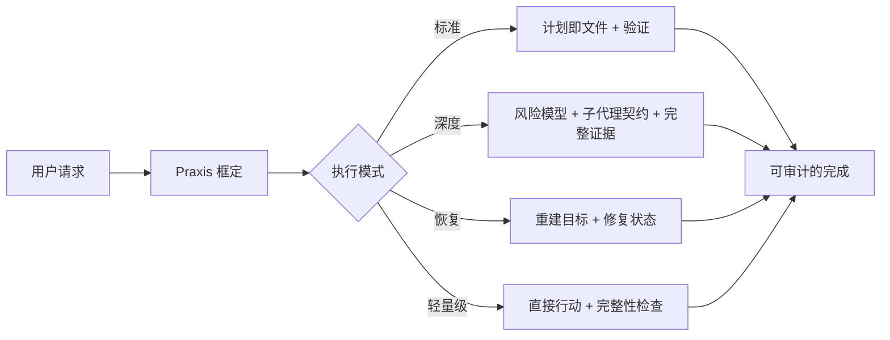
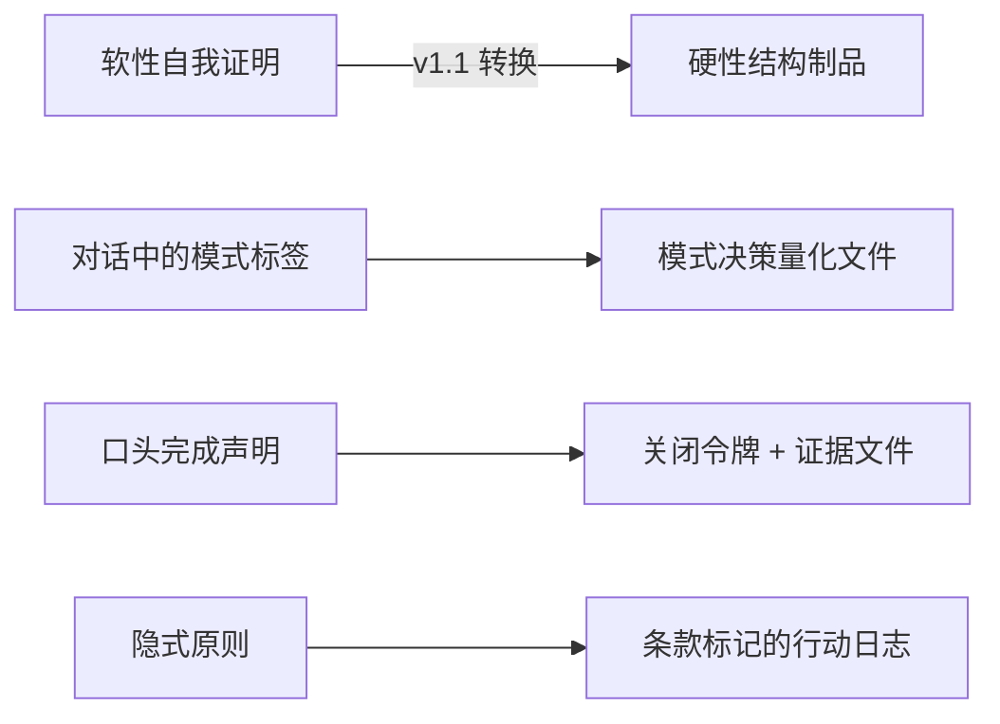
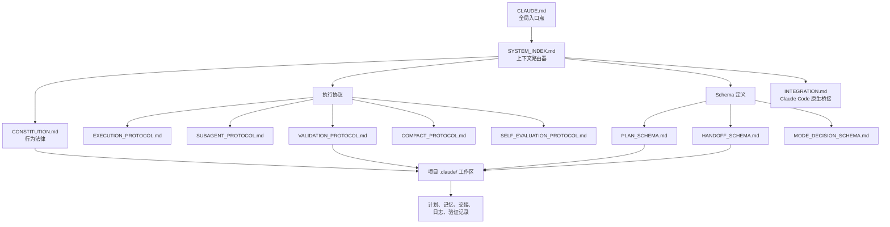
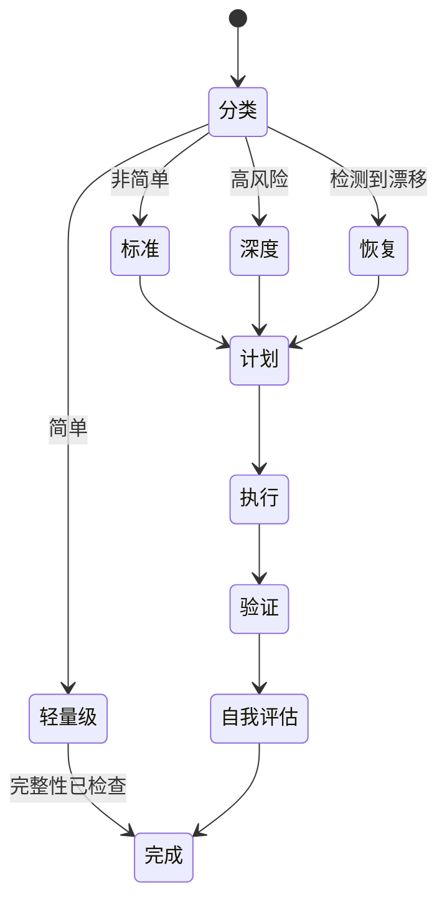

# Claude-Praxis

> 面向 Claude Code 的最系统化的 harness 系统。

[English](README.md) · [简体中文](README.zh-CN.md)

该名称源于希腊语 **praxis**（πρᾶξις）：有纪律的实践，理论在此转化为行动。代码写完不等于任务完成。

Claude-Praxis 将随意的 Claude Code 会话转化为结构化、可审计、可恢复的工作。它在 Claude Code 之上添加了一层轻薄的运作层：目标框定、模式选择、持久化规划、范围受限的子代理、验证证据，以及跨上下文压缩的连续性保障。

---

## 为何存在

Claude Code 本身已经很强大。问题不在于能力，而在于真实工作中的操作纪律：

- 用户请求往往是症状，而非真实目标
- 长会话在上下文压缩时会丢失状态
- 子代理在没有边界约束的交接时容易漂移
- 完成声明可能先于证据出现
- 小任务应保持轻量，但大任务需要结构

Claude-Praxis 补充了缺失的控制层，而不取代 Claude Code 的原生工具。



---

## Praxis 所解决的四类失效模式

这些不是假设性的边缘情况，而是在真实 Claude Code 会话中出现的 LLM 系统性规律。v1.1 专门针对这些问题进行了设计。

### a) 模式低估分类偏差

LLM 系统性地倾向于选择开销最低的执行分类，即便任务并非简单，也会偏向轻量级模式。这种偏差是不对称的——代理几乎从不高估分类。其效果是可预见的：计划即文件被跳过，验证阶梯从未触达，下游漂移在无可追溯原因的情况下积累。模式决策在当下感觉正确；其错误的证据只在事后才显现。

### b) 完成压力下的验证跳过

随着上下文填满或任务感觉"即将完成"，代理会产生强烈的收尾偏差，绕过验证阶梯。完成声明先于证据出现。这种失效模式在上下文窗口接近饱和时尤为严重——正是想要收尾的冲动最强烈、仔细审查的能力最低的时刻。

### c) 宪法违规的不可见性

行为法律被声明但未被观测。当代理在压力下绕过宪法原则——跳过计划文件、省略反 XY 检查——执行会悄无声息地继续。系统没有信号来触发纠正。漂移在未经审计的情况下积累。问题不在于代理无法遵守规则，而在于没有任何机制要求它们在不遵守时留下痕迹。

### d) 子代理搜索范围漂移

子代理在调查时自然倾向于扩展范围，侵蚀使分解工作安全的边界纪律。这一失效模式在 v1.0 中已通过将搜索范围责任置于调度主代理（而非子代理）一侧来解决（参见 `SUBAGENT_PROTOCOL.md` §7）。主代理拥有边界；子代理在其内执行。

---

## 设计哲学——自我证明 vs. 结构性制品

上述每种失效模式都有一个共同根本原因：**harness 要求代理遵守，却从未要求代理留下遵守的证据。** 在模型压力下的自我证明是不可靠的。听起来纪律严明的完成信息，与真正经过纪律性执行的完成，在表面上没有区别。

修复方案是结构性的：每个元决策都必须生成一个文件支持的制品，外部审查者——用户、未来的代理、审计子代理——无需询问即可检查。

v1.0 的 harness 已通过计划即文件将这一原则应用于*策略层*。v1.1 版本将其扩展至*元决策层*：分类决策、关闭声明和宪法遵循。



---

## v1.1 机制

针对每个机制：所解决的问题、所选设计方案、选择该方案而非备选方案的原因，以及制品存放位置。

### 1B — 模式决策量化文件

**解决：** 失效模式 (a)——模式低估分类偏差。

**机制：** 在采取任何首个行动之前，标准 / 深度 / 恢复模式任务必须在 `<repo>/.claude/_meta/mode-decisions/<plan-id>.md` 写入一个模式决策文件，符合 `MODE_DECISION_SCHEMA.md` 规范。该 schema 包含一个量化标准：文件数量、工具调用估算、领域数量、生产路径暴露情况、多阶段标志以及其他可测量的标准。分类决策从这些数字推导，而非依靠印象性判断。

**为何选择此方案而非备选：** 曾考虑过对抗性的"双方论证"机制——让代理在接受较低模式前明确论证更高模式。此方案被否决，转而支持量化标准。量化标准可由任何审查者在事后核实，无需了解原始上下文；而论证则无法如此。

**轻量级模式豁免。** 对简单任务的零摩擦原则得以保留。量化标准仅适用于选择了正式模式的情况。

**制品位置：** `<repo>/.claude/_meta/mode-decisions/<plan-id>.md`

---

### 2A — 关闭令牌

**解决：** 失效模式 (b)——完成压力下的验证跳过。

**机制：** 标准 / 深度 / 恢复模式中的完成声明必须包含如下形式的关闭令牌：

```
[CLOSURE: plan=<plan-id> evidence=<path> last-line="<证据文件最后一个非空行>" at=<ISO-8601>]
```

`last-line` 字段必须包含所引用证据文件的实际最后一个非空行。没有该字段，消息在语法上是不完整的——因此是可疑的。

**为何选择此方案而非备选：** 纪律层面的规则（"声明完成前必须验证"）在完成压力下会失效。它们也无法核实：遵守规则的消息与真正经过验证的消息在外观上完全相同。格式层面的规则将声明与证据在语法层面耦合——LLM 不能在不生成有效证据文件的情况下产生有效的关闭令牌，因为令牌中包含必须对应该文件的引用片段。

**轻量级模式直接输出"done"。** 关闭令牌仅适用于需要计划即文件的正式工作。

**制品位置：** `<repo>/.claude/_meta/validation/closure-<plan-id>.md`

---

### 3A — 条款标记行动日志 + 强制非空跳过规则

**解决：** 失效模式 (c)——宪法违规的不可见性。

**机制（两个部分）：**

1. `execution-log.md` 中的决策类行动必须携带宪法条款标记。示例：`[§VIII subagent-law] dispatch sa-investigator-1 — bounded to /src/auth/`
2. `SELF_EVALUATION_PROTOCOL.md` 中的"跳过规则"部分对非轻量级任务强制为非空。声称零跳过规则在默认情况下被视为可疑。

**为何选择此方案而非备选：** 对于宪法漂移，存在两种哲学上截然不同的应对方式：执行（囚禁代理）或可观测性（要求代理留下痕迹）。Praxis 选择了可观测性。执法使日常工作变得脆弱，并产生激励机制，促使代理将工作重新分类为轻量级以逃避约束。可观测性要求代理对自身执行诚实，这一方式更具可扩展性，并在 `metrics/` 中呈现真实的失效模式。

跳过规则的强制诚实规则对抗"虚假纯洁"失效模式。人类在真实条件下会跳过规则；LLM 也是如此。没有跳过规则、没有异常的自我评估，并不是完美执行的标志——而是粗心自我评估的标志。

**制品位置：** `<repo>/.claude/logs/execution-log.md`、`<repo>/.claude/validation/self-evaluation.md`

---

## 验证证据——我们如何知道 v1.1 有效

Praxis v1.1 通过将新规则应用于其自身实现来进行验证。在 v1.1 机制安装完成后，实施子代理（Sonnet 4.6，中等努力程度）返回了一份诚实的评估，其中包含关闭令牌的一个已知规避路径：不诚实的代理可以在不实际读取证据文件的情况下伪造 `last-line` 值。

这一诚实披露本身就是 v1.1 系统在发挥作用。根据新规则，`SELF_EVALUATION_PROTOCOL.md` 的"跳过规则"部分必须为非空，且默认情况下虚假纯洁是可疑的。子代理将这一局限性浮出水面而非隐藏——这正是 harness 被设计来产生的行为。

v1.1 第一批次发布的实际关闭令牌（v1.1.0 发布；v1.2.0 token 减量工作详见 CHANGELOG）：

```
[CLOSURE: plan=plan-praxis-v11-batch1-v001 evidence=_meta/validation/closure-praxis-v11-batch1-v001.md last-line="praxis-v11-batch1-closed-2026-04-27" at=2026-04-27T08:47:02Z]
```

---

## 路线图——前进的优化路径

每个后续批次都以 `metrics/` 中积累的 v1.1 任务数据为门控条件。harness 的演进速度不应超过证据所支持的速度。

### 下一步：3D — 阶段边界审计子代理

**为何优先：** 直接解决 v1.1 第一批次验证中发现的关闭令牌可伪造问题。在阶段边界调度的审计子代理会重新读取引用的证据文件，并验证关闭令牌中的 `last-line` 值是否与文件内容实际匹配。这填补了 v1.1 留下的密码学漏洞。

### 然后：2B — 两阶段关闭

**为何其次：** 将"实现完成"与"关闭完成"分离为物理上独立的制品——一个关闭资格消息，随后是一个关闭完成文件。这增加了刻意的摩擦，消除了一类代理将完成代码与完成任务混为一谈的过早完成失效。

### 然后：2C — 上下文预算护栏

**为何第三：** 该机制需要带有上下文利用率估计的钩子，或 Claude Code 尚未向 harness 层暴露的原生能力。推迟至平台支持对剩余上下文预算的检查后再实施。一旦可用，这将在失效模式 (b) 最为严重的时刻直接解决它。

### 然后：1A — 量化运行时升级

**为何最后：** 量化文件（1B）加上标准模式监控已在任务开始时捕获低估分类。运行时自动升级是附加的——有用，但不是当前失效模式中的主要缺口。

### 已发布：v1.2.0 — Token 成本减量

按用户驱动的基线测量实施：5 级读集分层、瘦身的 CLAUDE.md、强制 thin-dispatch（通过 packet 文件，修正了对 HANDOFF_SCHEMA §1 的违规）、Anti-XY 去重。每任务开销减少约 50%。详见 `metrics/token-cost-baseline.md` 与 `install.sh --changelog 1.2.0`。

---

## 诚实的残余风险

v1.1 缩小了差距但没有填平它。这些局限性记录于此，而非埋于细节之中。

- **关闭令牌可伪造性。** `last-line` 值可由不诚实的代理在不打开证据文件的情况下伪造。在审计子代理（3D）存在之前，这一问题无法检测，而 3D 目前尚不存在。
- **模式量化标准估算偏差。** 量化标准中的数字（文件数量、工具调用数量、领域数量）是代理估算的。估算本身可能受到与量化标准旨在纠正的相同向下偏差的影响。由未来的运行时升级（1A）缓解。
- **钩子是建议性的。** 错过 SessionStart 钩子确认的会话可以在未加载 harness 的情况下继续。钩子发出不合规信号但不阻止它。
- **条款标记准确性未经验证。** 代理可能错误标记行动——将 `[§II goal-truth]` 标记在受 `§X verification` 约束的行动上——而不触发任何错误。标记是痕迹，不是证明。

这些不是缺陷，而是选择可观测性而非执法所付出的代价。针对这些残余风险的防御措施是：在 `metrics/` 中积累证据、通过未来审计子代理（3D）进行同行审查，以及对执行日志进行人工检查。

---

## 核心理念

Claude-Praxis 不是提示词包，而是面向代理工程工作的**治理层**。

它区分了 AI 编程会话中经常被混淆的四件事：

| 层次 | 问题 | Praxis 的答案 |
|---|---|---|
| 意图 | 用户真正想实现什么？ | 反 XY 审查和目标建模 |
| 策略 | 跨阶段或跨会话应该发生什么？ | 版本化计划文件 |
| 执行 | 现在应该发生什么？ | Claude Code 原生工具、TodoWrite、Skills、MCP |
| 证据 | 我们如何知道它有效？ | 验证阶梯和自我评估 |

结果是一个行为更像谨慎工程操作员而非单次自动补全循环的代理。

---

## 架构



### 仓库文件映射

| 文件 | 作用 |
|---|---|
| `CLAUDE.md` | 全局入口点和执行模式规则 |
| `SYSTEM_INDEX.md` | 仅加载所需协议文件的路由索引 |
| `CONSTITUTION.md` | 高级行为法律：反 XY、持久状态、验证 |
| `INTEGRATION.md` | 与 Claude Code 原生功能的映射：TodoWrite、Agent、Skills、MCP、钩子 |
| `EXECUTION_PROTOCOL.md` | 主执行循环和模式驱动行为 |
| `SUBAGENT_PROTOCOL.md` | 范围受限的子代理调度和搜索边界契约 |
| `VALIDATION_PROTOCOL.md` | 代码和非代码可交付物的证据阶梯 |
| `COMPACT_PROTOCOL.md` | 上下文压缩前后的连续性 |
| `SELF_EVALUATION_PROTOCOL.md` | 非简单工作的任务后自我审计 |
| `MODE_DECISION_SCHEMA.md` | 模式分类量化标准；标准/深度/恢复模式的必需制品 |
| `PLAN_SCHEMA.md` | 版本化计划文件 schema |
| `HANDOFF_SCHEMA.md` | 子代理任务和结果 schema |
| `PROJECT_STRUCTURE_SPEC.md` | 项目本地 `.claude/` 工作区规范 |
| `MIGRATION_PROTOCOL.md` | 版本控制、迁移、同步和漂移规则 |
| `install.sh` | 幂等安装程序和完整性检查器 |
| `settings.json.sample` | Claude Code settings 的建议性钩子样本 |
| `metrics/` | 协议遵守和失效模式的可选聚合记录 |

---

## 执行模式

Praxis 避免将每个请求都变成仪式。工作首先被分类。

| 模式 | 使用场景 | 协议开销 |
|---|---|---|
| `lightweight`（轻量级） | 简单任务：≤2 个文件、≤8 次工具调用、单一领域、无需持久状态 | 无计划文件；直接工作加完整性检查 |
| `standard`（标准） | 普通的非简单工作 | 计划即文件、验证阶梯、自我评估 |
| `deep`（深度） | 重构、迁移、架构决策、多代理工作、高风险 | 完整协议、风险跟踪、边界受限的子代理 |
| `recovery`（恢复） | 检测到漂移：目标丢失、跳过验证、计划状态损坏 | 重建目标并修复持久状态 |



---

## 项目工作区

对于非简单工作，Praxis 会创建或使用项目本地的 `.claude/` 工作区。

```text
<repo>/.claude/
├── WORKSPACE_INDEX.md
├── CLAUDE.md
├── constitution/
├── context/
├── plans/
│   ├── active/
│   └── archive/
├── memory/
├── handoffs/
│   ├── inbox/
│   ├── outbox/
│   └── shared/
├── validation/
└── logs/
```

这个工作区是持久化的基底。对话有其价值，但文件才是权威来源。

---

## 安装

克隆仓库：

```bash
git clone https://github.com/ZIONISREAL/Claude-Praxis.git
cd Claude-Praxis
```

试运行安装程序：

```bash
./install.sh --from . --dry-run
```

安装或升级：

```bash
./install.sh --from .
```

检查现有安装：

```bash
./install.sh --check
```

Claude Code settings 因用户而异。本仓库提供 `settings.json.sample`；如需建议性钩子信号，请将其 `hooks` 合并到您的 `~/.claude/settings.json`。

### 更新已有安装

```bash
~/.claude/install.sh --check-version    # 查看是否有新版本
~/.claude/install.sh --changelog        # 查看更新内容
~/.claude/install.sh --update           # 应用更新（需要 git clone 安装的源）
```

---

## 钩子哲学

钩子是有意为建议性的。它们使协议遵守可见，但不阻止工具执行。


这一点很重要，因为强制执行可能使日常工作变得脆弱。Praxis 的目标是在不将工具变成囚笼的情况下实现有纪律的行为。

---

## 版本与许可证

当前版本：参见 `VERSION` 和 `CHANGELOG.md`。

许可证：MIT。参见 `LICENSE`。

---

## 致谢

通过与 Claude（Opus 4.7 编排器 + Sonnet 4.6 子代理）的结构化协作设计和实现。harness 被用于构建其自身；参见 `_meta/plan-v001.md` 和 `_meta/plan-v002.md`，了解系统自身构建的可追溯计划。
