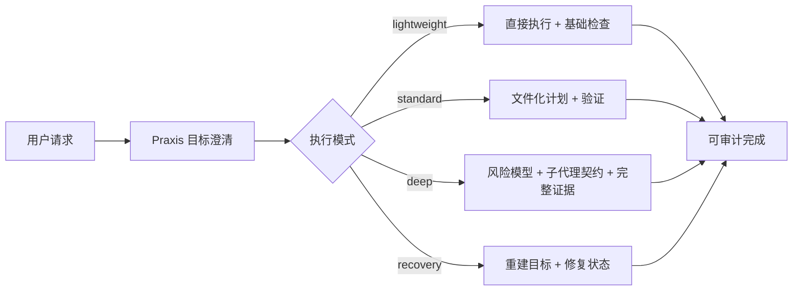
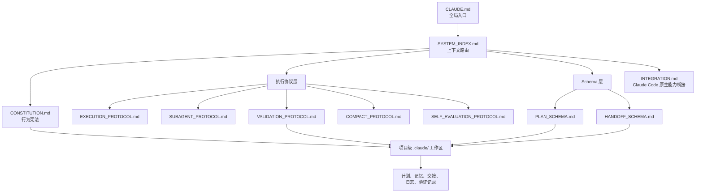
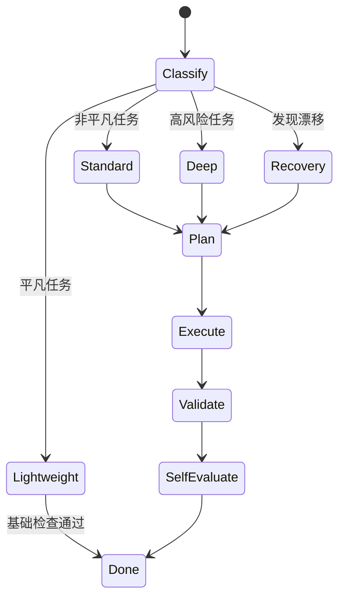

# Claude-Praxis

> 面向 Claude Code 的宪法式执行框架。

[English](README.md)

Claude-Praxis 把临时、一次性的 Claude Code 会话，转化为有结构、可审计、可恢复的工程执行过程。它不是替代 Claude Code，而是在 Claude Code 外面加上一层轻量操作系统：目标澄清、模式选择、文件化计划、受约束的子代理、验证证据，以及上下文压缩后的连续性。

Praxis 来自希腊语 **praxis** (πρᾶξις)，意思是有纪律的实践，也就是理论与行动的统一。在这个项目里，核心判断很简单：

**代码写完，不等于任务完成。**

## 为什么需要它

Claude Code 已经很强。问题通常不在能力，而在真实工程环境里的执行纪律：

- 用户提出的需求常常只是症状，不是真正目标
- 长会话在上下文压缩后容易丢失状态
- 子代理如果没有边界，容易漂移或重复扫描
- Agent 容易在证据不足时声称完成
- 小任务应该保持轻量，大任务又必须有结构

Claude-Praxis 补的是这层缺失的控制平面，并且尽量不重复 Claude Code 原生能力。



## 核心思想

Claude-Praxis 不是提示词包，而是一个 **agent 工程治理层**。

它把 AI 编程会话里经常混在一起的四件事拆开：

| 层级 | 关键问题 | Praxis 的回答 |
|---|---|---|
| 意图 | 用户真正想达成什么？ | Anti-XY 审查与 objective modeling |
| 策略 | 跨阶段、跨会话应该如何推进？ | 版本化 plan 文件 |
| 执行 | 当前这一步应该做什么？ | Claude Code 原生工具、TodoWrite、Skills、MCP |
| 证据 | 如何证明它真的完成了？ | 验证阶梯与自我审计 |

这样，Agent 不再只是一次性 autocomplete 循环，而更像一个谨慎的工程执行者。

## 架构



### 文件地图

| 文件 | 作用 |
|---|---|
| `CLAUDE.md` | 全局入口与执行模式规则 |
| `SYSTEM_INDEX.md` | 路由索引，只加载当前任务需要的协议文件 |
| `CONSTITUTION.md` | 高阶行为宪法：Anti-XY、持久状态、验证 |
| `INTEGRATION.md` | 与 Claude Code 原生能力的映射：TodoWrite、Agent、Skills、MCP、hooks |
| `EXECUTION_PROTOCOL.md` | 主执行循环与模式驱动行为 |
| `SUBAGENT_PROTOCOL.md` | 子代理派发、范围约束和搜索边界契约 |
| `VALIDATION_PROTOCOL.md` | 代码与非代码交付物的验证阶梯 |
| `COMPACT_PROTOCOL.md` | 上下文压缩前后的连续性协议 |
| `SELF_EVALUATION_PROTOCOL.md` | 非平凡任务结束后的自我审计 |
| `PLAN_SCHEMA.md` | 版本化计划文件 schema |
| `HANDOFF_SCHEMA.md` | 子代理任务包与结果 schema |
| `PROJECT_STRUCTURE_SPEC.md` | 项目级 `.claude/` 工作区规范 |
| `MIGRATION_PROTOCOL.md` | 版本、迁移、同步和漂移检测规则 |
| `install.sh` | 幂等安装器与完整性检查器 |
| `settings.json.sample` | Claude Code advisory hooks 示例 |
| `metrics/` | 协议遵守、失败模式、改进建议的可选聚合记录 |

## 执行模式

Praxis 不会把每个请求都变成复杂仪式。它先分类，再决定启动多少协议。

| 模式 | 适用场景 | 协议开销 |
|---|---|---|
| `lightweight` | 平凡任务：不超过 2 个文件、不超过 8 次工具调用、单一领域、不需要持久状态 | 不创建 plan 文件，直接执行并做基础检查 |
| `standard` | 普通非平凡任务 | 文件化计划、验证阶梯、自我审计 |
| `deep` | 重构、迁移、架构决策、多代理协作、高风险任务 | 完整协议、风险追踪、受约束子代理 |
| `recovery` | 发现漂移：目标丢失、跳过验证、计划状态损坏 | 重建目标并修复持久状态 |



## 项目工作区

对于非平凡任务，Praxis 会创建或使用项目本地的 `.claude/` 工作区。

```text
<repo>/.claude/
├── WORKSPACE_INDEX.md
├── CLAUDE.md
├── constitution/
├── context/
├── plans/
│   ├── active/
│   └── archive/
├── memory/
├── handoffs/
│   ├── inbox/
│   ├── outbox/
│   └── shared/
├── validation/
└── logs/
```

这个工作区是执行系统的持久基底。对话很有用，但文件才是长期可信的系统记录。

## 为什么这样更好

### 1. 它优化真实目标，而不是表面指令

Praxis 会要求 Agent 区分“用户字面上说了什么”和“用户真正想解决什么”。这能减少把错误前提打磨成漂亮错误答案的情况。

### 2. 它能承受长会话和上下文压缩

计划、决策、假设、风险、被拒绝路径、验证结果和 compact summary 都会进入文件。未来会话可以从项目工作区恢复，而不是依赖脆弱的聊天上下文。

### 3. 它让子代理变得可审计

子代理拿到的是有边界的任务包，返回的是结构化结果。主 Agent 仍负责整合、提升为项目记忆，以及最终判断。

### 4. 它区分战略和战术

Claude Code 原生的 TodoWrite 很适合当前会话的步骤管理。Praxis 的 plan 文件负责跨会话战略。`INTEGRATION.md` 明确定义两者如何共存。

### 5. 它用证据定义完成

验证阶梯避免把“已经实现”误认为“已经完成”。对文档、配置、设计、schema 这类非代码任务，`VALIDATION_PROTOCOL.md` 也提供了专门的非代码验证分支。

## 安装

克隆仓库：

```bash
git clone https://github.com/ZIONISREAL/Claude-Praxis.git
cd Claude-Praxis
```

先 dry-run：

```bash
./install.sh --from . --dry-run
```

安装或升级：

```bash
./install.sh --from .
```

检查已有安装：

```bash
./install.sh --check
```

Claude Code 的 settings 是用户本地配置。仓库提供 `settings.json.sample`，如果你希望启用 advisory hook 信号，请把其中的 `hooks` 合并到你的 `~/.claude/settings.json`。

## Hook 哲学

Hooks 是 advisory 的。它们让协议遵守情况变得可见，但不阻断工具执行。


这很重要。硬性拦截容易让日常工作变脆。Praxis 追求的是有纪律的执行，而不是把工具关进笼子。

## Benchmark 设想

Claude-Praxis 是工作流框架，所以性能不应该只看 token 速度，而应该看任务结果。

### 建议的 Benchmark 设计

同一组任务跑两遍：

1. **Baseline**：未安装 Praxis 的 Claude Code
2. **Praxis**：安装 Claude-Praxis 后的 Claude Code

任务集建议包含 20-40 个代表性任务：

| 任务类型 | 示例 |
|---|---|
| Lightweight | 重命名字段、调整配置、更新一份文档 |
| Standard | 跨 3-6 个文件实现一个小功能 |
| Deep | 重构模块、迁移 API、拆分服务 |
| Recovery | 在上下文压缩或验证失败后恢复任务 |
| Anti-XY | 用户要求表面修复，但真正根因在别处 |

### 指标

| 指标 | 衡量什么 | 预期方向 |
|---|---|---|
| 一次完成成功率 | 第一次完成后任务是否真的可用 | standard/deep 任务更高 |
| 目标匹配分 | 是否解决真实问题，而不是只满足字面要求 | 更高 |
| 验证覆盖率 | 完成前是否产生了有意义的证据 | 明显更高 |
| 上下文恢复时间 | 压缩或重启后恢复任务所需时间 | 更低 |
| 返工率 | 因遗漏假设导致的后续修复次数 | 更低 |
| 轻量任务开销 | 平凡任务额外耗时 | 如果模式分类有效，应接近零 |
| token / tool 开销 | harness 带来的额外读写和工具调用 | deep 任务会更高，lightweight 应受控 |

### 示例计分表

```text
task_id,mode,baseline_success,praxis_success,baseline_minutes,praxis_minutes,
baseline_validation_level,praxis_validation_level,rework_count,objective_fit_1_to_5
```

这个 tradeoff 是有意设计的：

- 小任务应该接近 baseline 的速度
- standard/deep 任务会在前期多花一点成本
- 复杂任务应通过更少重启、更少遗漏假设、更强验证证据来收回成本

## 状态

当前版本：`1.0.1`

详见 `VERSION` 和 `CHANGELOG.md`。

## License

MIT。详见 `LICENSE`。
